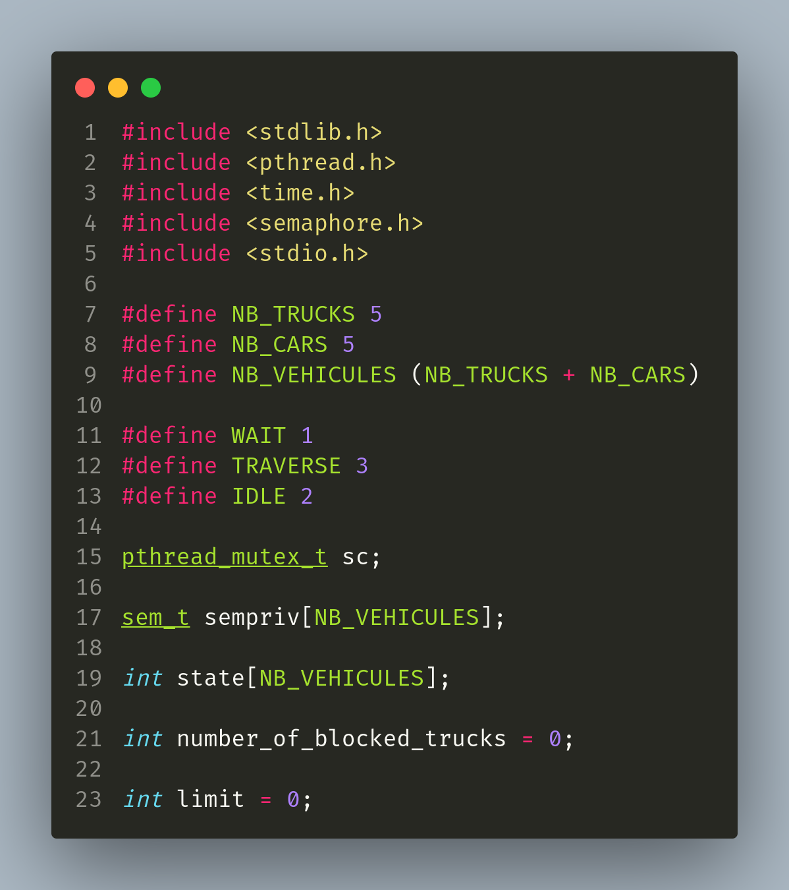
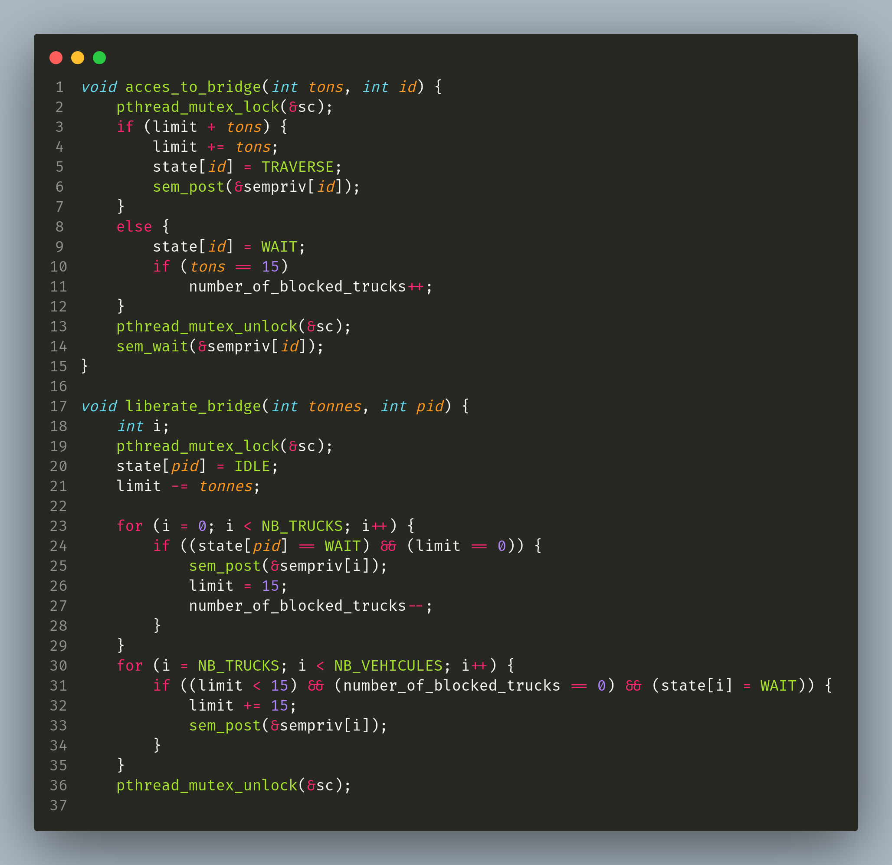
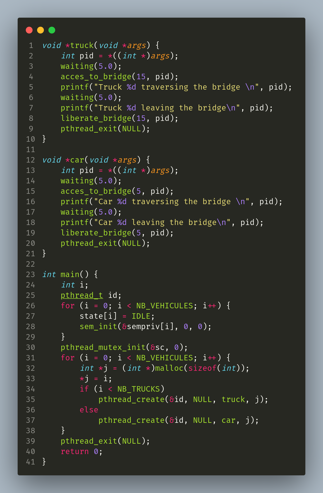
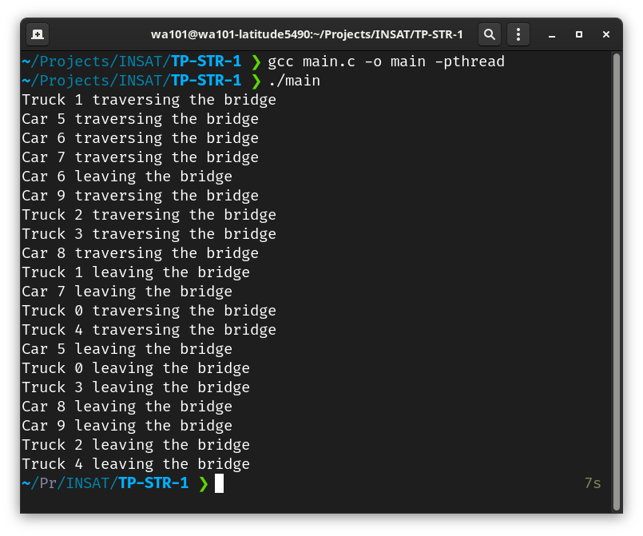

# TP 1 Bridge Problem

## Problem
Un pont supporte une charge maximale de 15 tonnes. Ce pont est traversé par
des camions dont le poids est de 15 tonnes ainsi que par des voitures dont le
poids est de 5 tonnes. On vous demande de gérer l'accès au pont de sorte que
la charge maximale du pont soit respectée.

## Code

 
 
 

## Execution de code
